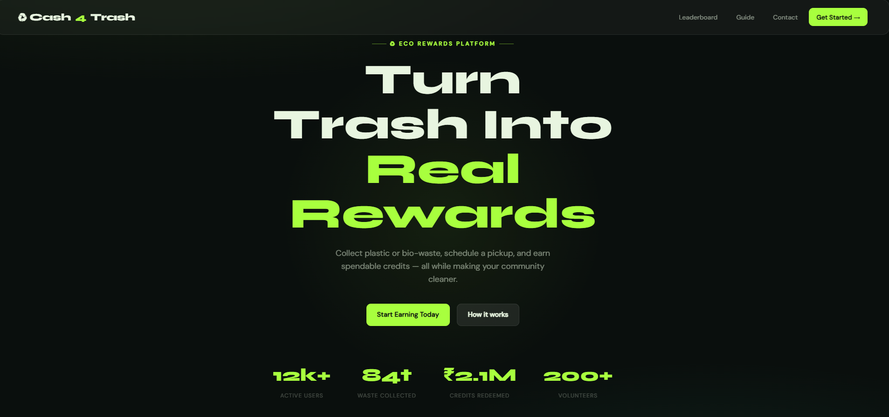
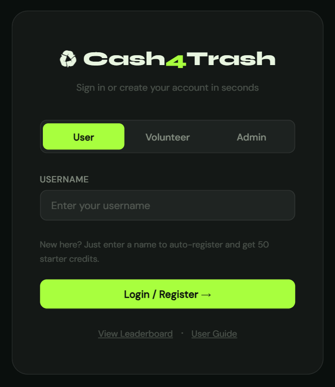
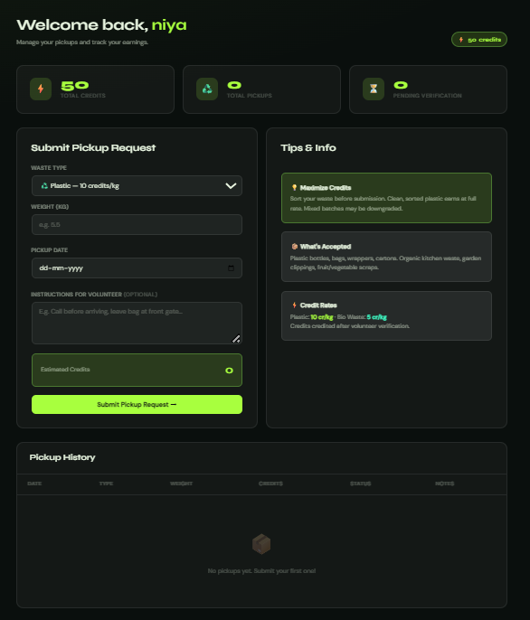
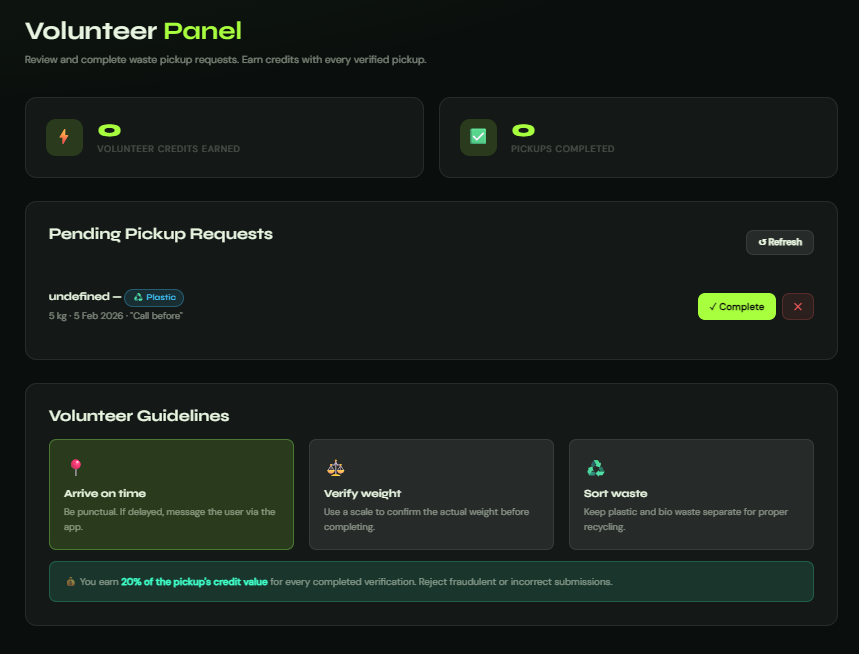

  

# Cash4Trash 🎯

## Basic Details

### Team Name: [STCS]

### Team Members
- Member 1: [Niya Mary Joseph] - [Mar Baselios College of Engineering and Technology ]
- Member 2: [Arathy Krishna A M] - [Mar Baselios College of Engineering and Technology]

### Hosted Project Link
https://mellow-sunburst-222d5d.netlify.app/
### Project Description
Cash4Trash is a platform where people can give their plastic or bio waste for collection and earn reward credits. It connects users and volunteers to promote clean surroundings and encourage eco-friendly habits.

### The Problem statement
Improper waste disposal and lack of incentives reduce community participation in responsible waste management.

### The Solution
Cash4Trash provides a platform that rewards people with credits for responsibly submitting waste for verified collection, encouraging cleaner communities and sustainable habits.

---

## Technical Details

### Technologies/Components Used

**For Software:**
- Languages used: [ JavaScript,HTML, CSS]
- Tools used: [ VS Code, Git]

---

## Features

List the key features of your project:
- Feature 1: [User waste pickup submission with live credit estimation.]
- Feature 2: [Volunteer verification system to confirm collections and approve credits.]
- Feature 3: [Credit-based rewards system with unlockable coupons.]
- Feature 4: [Leaderboard tracking (monthly, yearly, and overall) to encourage community participation.]

---

## Project Documentation

### For Software:

#### Screenshots (Add at least 3)

*Homepage of the website is displayed*

*Shows the user login page*

*Shows the user login page*

*Shows the volunteer login page*

---

#### Build Photos

---

**Base URL:** https://mellow-sunburst-222d5d.netlify.app/

---

#### App Flow Diagram

*Explain the user flow through your application*

---

## AI Tools Used (Optional - For Transparency Bonus)

If you used AI tools during development, document them here for transparency:

**Tool Used:** [e.g., GitHub, Gemini, ChatGPT, Claude, Netify]

**Purpose:** [What you used it for]
- Chatgpt: "Generated code"
- Gemini, Claude: "To modify the code"
- Netify: "To deploy the project"

**Percentage of AI-generated code:** [Approximately 80%]

**Human Contributions:**
- Architecture design 
- Idea and planning
- Custom business logic implementation
- Integration and testing
- UI/UX design decisions
- Frontend Development
- Content creation

*Note: Proper documentation of AI usage demonstrates transparency and earns bonus points in evaluation!*

---

## Team Contributions

- [Niya Mary Joseph]: [Specific contributions - e.g., Frontend development, API integration, etc.]
- [Arathy Krishna A M]: [Specific contributions - e.g., Research,Github etc.]

## License

This project is licensed under the [MIT] License - see the [LICENSE](LICENSE) file for details.

**Common License Options:**
- MIT License (Permissive, widely used)
- Apache 2.0 (Permissive with patent grant)
- GPL v3 (Copyleft, requires derivative works to be open source)

---

Made with ❤️ at TinkerHub
